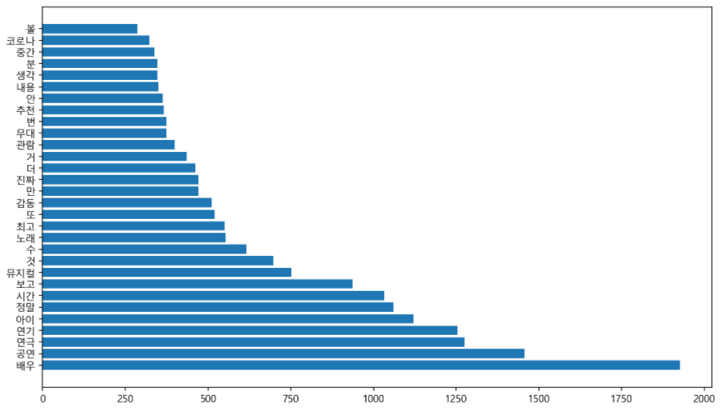
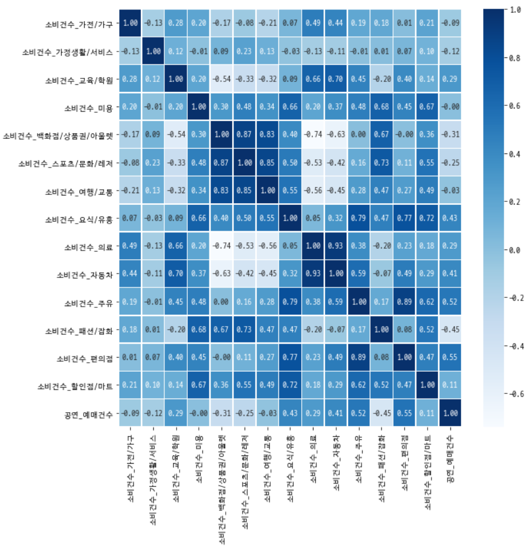
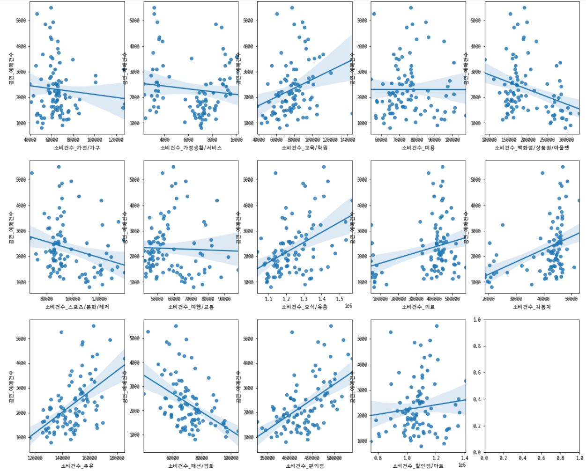

# KOPIS 빅데이터 분석 공모전

> 🏆 입상(장려상)

### 기간

```2021.06.28.``` ~ ```2021.09.29.``` (3개월)

<br><br>

#  기술 스택

### Data Analysis

<div>
  
  
  
  
</div>

### Communication

<div>
  
</div>

<br><br>

#  배경

- 스트리밍 서비스에 의해 공연장을 찾는 20대 관객이 줄고, 구매력이 높은 30⋅40대가 빈자리를 채운다.
- 기존 공연 예술 시장의 주 타깃이었던 20대 관객이 줄어들고 있다.

💡 **40⋅50대 관객층 유입을 통한 공연 예술계의 새로운 비즈니스 기회 창출**

<br><br>

#  분석 방법

### 사용 데이터

- KOPIS 공연 예술 예매 데이터
- 네이버 예매자 리뷰 데이터
- 삼성카드 소비 변화 데이터 (5~7월)

<br>

### 키워드 분석

👉 **키워드 분석을 통해 40⋅50대가 공연을 소비하는 이유를 파악**

1. 40⋅50대가 많이 관람한 공연명 찾기
2. 공연 리뷰 크롤링
3. 리뷰 키워드 분리 및 시각화

<br>

### 공연 예매와 카드 소비의 상관관계 분석

👉 **40⋅50대의 공연 예매에 영향을 미치는 소비 항목 분석**

1. 히트맵과 산점도 그래프를 통해 선형성 확인
2. VIF(Variance Inflation Factor)를 이용하여 다중공선성 확인
3. Statsmodels 라이브러리의 OLS를 이용하여 다중선형회귀분석 수행

<br><br>

#  결과

### 키워드 분석



- 총 62749개 명사 추출
- 명사 빈도수 측정을 통해 언급된 서로 다른 명사 4385개
- 가장 많이 언급된 단어의 횟수 1926번
- ```배우``` > ```공연``` > ```연극``` > ```연기``` > ```아이``` > ```정말``` > ```시간```

<br>

### 상관관계 분석

| Heat Map | Scatter Graph |
| --- | --- |
|  |  |

| OLS Regression Results |
| --- |
|  |

- 결정 계수: 40⋅50대 여성에서 73.2%로 가장 높게 나타남
- F-statistic: 40⋅50대 남성에서 가장 낮게 나타남
- 독립변수 ```소비건수_패션/잡화```가 1 증가할 때 종속변수 ```공연예매건수```는 감소하는 양상을 보임

<br><br>

#  활용 방안

### 키워드 분석 결과

> ```배우``` > ```공연``` > ```연극``` > ```연기``` > ```아이``` > ```정말``` > ```시간```

➡️ 40⋅50대를 타깃으로 한 공연을 제작할 때, ```아이```와 함께 ```시간```을 보낼 수 있는 ```공연```을 제작한다면 40⋅50대 공연 소비를 활성화할 수 있을 것이다.

<br>

### 상관관계 분석 결과

| 소비 건수 | 공연 예매 |
| --- | --- |
| 여행/교통 1 🔺 | 0.0112 ▼ |
| 요식/유흥 1 🔺 | 0.008 🔺 |
| 패션/잡화 1 🔺 | 0.0675 ▼ |

➡️ 각각의 소비 건수를 파악을 통해 공연 예매 건수를 예측하여 공연 예술 활성화를 위한 전략을 제시할 수 있다.

<br><br>

#  기대 효과

1. 토픽 모델링
2. 장바구니 분석
3. 예매 예측 시스템
4. 맞춤 마케팅

<br><br>

#  한계점

<details>
  <summary>
    <b>크롤링한 리뷰에서 명사를 분리하기 위해 Okt 형태소 분석기를 사용</b>
  </summary>
  <div markdown="1">

    텍스트 데이터에서 명사를 분류할 때 명사를 분류하는 기준이 추가적으로 필요하다.
    
  </div>
</details>
<details>
  <summary>
    <b>리뷰 데이터에서 나타난 결과만으로 40⋅50대 전체의 경향성을 파악하기 어려움</b>
  </summary>
  <div markdown="1">

    공연 리뷰를 분석함으로써 실제 공연 관람객의 선호도를 반영하여 공통적으로 나타나는 주제를 발견한 것에 의의를 둔다.
    또한 분석 결과를 토대로 토픽 모델링을 통해 공연의 흥행 요인을 분석할 수 있다.

  </div>
</details>
<details>
  <summary>
    <b>삼성카드 소비건수 데이터가 5~7월에 한해서 제공</b>
  </summary>
  <div markdown="1">

    2020년 전체 소비건수 데이터를 얻을 수 있다면,
    2020년 한 해의 경향을 확인하고 다중선형회귀분석 모델의 설명력을 높일 수 있을 것이다.

  </div>
</details>
<details>
  <summary>
    <b>다소 높은 다중공선성 수치</b>
  </summary>
  <div markdown="1">

    향후 최적화된 모델을 찾는 것이 용이한 Scikit-learn 라이브러리를 이용함으로써 
    다중공선성 요인을 해결하고 더 높은 설명력을 갖는 결과를 제시할 수 있을 것이다.

  </div>
</details>

<br><br>

#  팀원 소개

| 정세영 | 연주원 | 이승원 | 정유지 |
|:---:|:---:|:---:|:---:|
|  |  |  |  |
| 팀장<br>기획<br>키워드 분석 | 기획<br>상관관계 분석 | 기획<br>발표자료 작성 | 기획<br>최종 발표 |
